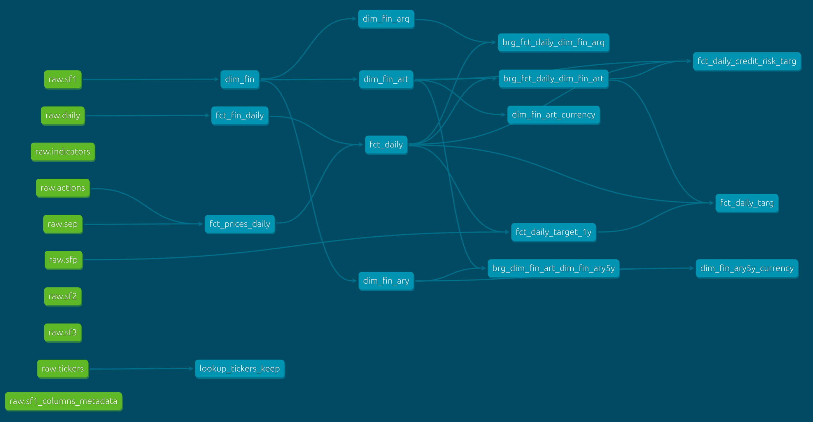

# Bottom line up front
- You probably don't understand your business as well as you think.
- Dashboards and SQL are not data analysis tools
- *What am I missing?* is the most important question in data.
- Analysts must over-measure then distill (using machine learning).
- Statistical testing (A/B/n) is important, but we need better theories to test. This is how you get them.

See [notebook 3](./3_understanding.ipynb) for more information.

# Intro
This project uses a simple Linux setup to model stock market data. Because it was written on a powerful GPU-enabled workstation, it may require modification to run in different environments. The data are from the [Sharadar Core US Equities Bundle](https://data.nasdaq.com/databases/SFA). Environmental variables `NASDAQ_DATA_API_KEY` and `DATA_HOME` are expected. [Anaconda](https://www.anaconda.com/download) is used for the Python distribution.

# Project structure
The `download.py` script fetches the tables via the Nasdaq API and stores them in `$DATA_HOME/analytics_demo`, both within a [duckdb](https://www.duckdb.org) file and individually as parquet files. The [dbt](https://www.getdbt.com) project, located in the [dbt_sharadar_demo folder](./dbt_sharadar_demo), must then be run for preprocessing. See the lineage graph below to get a sense of its structure. The Jupyter notebook `1_feature_prep.ipynb` must be run before notebooks 2 and 3.



# Setup
1. Create anaconda environment then activate.
```bash
conda env create -f environment.yml --solver=libmamba
conda activate analytics_demo
```
2. Set up dbt config, typically found at `~/.dbt/profiles.yml`, to include the database filepath.
```yaml
dbt_sharadar_demo:
  outputs:
    prod:
      type: duckdb
      path: "{{ env_var('DATA_HOME') }}/analytics_demo/sharadar.duckdb"
      threads: 2
  target: prod
```
3. Fetch tables.
```python
python3 download.py
```
3. Move to the dbt folder to run dbt.
```bash
cd dbt_sharadar_demo
dbt run
cd ..
```
4. Launch Jupyter to host notebooks if you prefer this over an IDE.
```python
jupyter lab
```

## Tear down

To remove the anaconda environment, simply run:
```bash
conda env remove --name analytics_demo
```

[See here](https://docs.anaconda.com/anaconda/install/uninstall/) if you also wish to remove Anaconda.

---

### Disclaimer: **I am not an investment professional. None of my work within or related to this repository should be considered investment advice. It is not.**